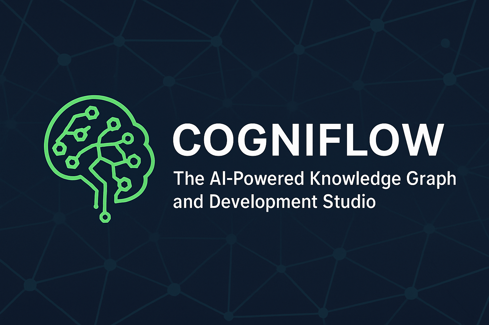

<div align="center">
  
  
  <h1>COGNIFLOW</h1>
  <p><strong>The Intelligent Second Brain & Development Studio</strong></p>
  
  [](https://www.npmjs.com/package/@chieji/cogniflow)
  [](LICENSE)
  [](CONTRIBUTING.md)
  [](#)
  [](#)
  [](#)
</div>

---

## 🚀 Overview

**COGNIFLOW** is a professional-grade, AI-powered knowledge management system designed for developers, researchers, and power users. It seamlessly combines intelligent note-taking, code snippet management, and visual knowledge graph visualization into a unified platform. 

With multimodal AI capabilities (voice, vision, text), offline-first architecture, and production-ready infrastructure, COGNIFLOW bridges the gap between structured organization and active development—enabling discovery, creation, and collaboration at scale.

## 📋 Project Status & Roadmap

COGNIFLOW is currently in **Phase 3: Production Readiness** with 47 commits and active development. See our [ROADMAP.md](ROADMAP.md) for detailed development plans and upcoming features.

**Recent Achievements (Phase 3):**

- ✅ **Shadcn/Radix UI Library**: 14+ production-ready components for enterprise UX
- ✅ **Enhanced Sidebar**: SidebarEnhanced with improved navigation and organization
- ✅ **API Rate Limiting**: Upstash Redis integration (10 req/10s) for security
- ✅ **Toast Notifications**: Sonner-powered notification system with use-toast hook
- ✅ **PWA & Offline Mode**: Installable as native app with full offline support
- ✅ **Voice-to-Note**: Real-time speech recognition with auto-punctuation
- ✅ **Visual Intelligence**: Gemini Vision for image analysis and object detection
- ✅ **Smart Recommendations**: AI-driven tag suggestions and note linking
- ✅ **Version History**: Auto-save with restore functionality
- ✅ **Professional AI Chat**: streaming responses with assistant-ui
- ✅ **Knowledge Graph**: D3.js-powered semantic visualization
- ✅ **Customizable Themes**: Red/Black dark & White/Red light modes with accent colors

**Next Priorities:**

- 🔄 Cloud Backup Integration (Box.com/Google Drive)
- 🔄 PDF Export with formatting preservation
- 🔄 Advanced Performance Monitoring & Analytics
- 🔄 Multi-user Collaboration Features
- 🔄 Plugin System for Extensibility

## ✨ Latest Updates (Phase 3)

### Jan 22, 2025 - Enterprise UI & Security Hardening
- **Shadcn/Radix Component System**: Integrated 14+ production-ready components (badge, card, dialog, dropdown, input, label, select, separator, skeleton, switch, tabs, textarea, toast, toaster) for consistent, accessible UI
- **API Rate Limiting**: Implemented Upstash Redis-backed rate limiting (10 requests/10 seconds) to protect against abuse and ensure fair resource usage
- **Toast Notification System**: Integrated Sonner for elegant, customizable toast notifications with the `use-toast` hook
- **Enhanced Sidebar**: New `SidebarEnhanced` component with improved navigation, organization, and visual hierarchy
- **Input Validation**: Added Zod schema-based request validation in API proxy for security and type safety
- **Utility Enhancements**: New `src/lib/utils.ts` with modern utility functions and Tailwind class merging

### Recent Phases
- **Progressive Web App (PWA)**: Installable on desktop and mobile with offline support and zero-latency access
- **Multimodal AI**: Voice dictation and image analysis using Gemini Vision API
- **Knowledge Graph**: Interactive D3.js visualization of note relationships and semantic connections
- **Professional AI Chat**: Real-time streaming responses with sophisticated threading and formatting
- **Smart Organization**: AI-powered tag suggestions and automatic note linking
- **Custom Theming**: Red/Black dark mode and White/Red light mode with configurable accent colors

## 🛠 Key Features

| Feature | Description | AI Integration |
| :--- | :--- | :--- |
| **PWA & Offline** | Works without internet, installable on devices. | Local AI caching for continued operation. |
| **Voice-to-Note** | Dictate thoughts directly into notes. | Speech-to-text with auto-punctuation. |
| **Visual Analysis** | Analyze attached images and diagrams. | Gemini Vision for object/text detection. |
| **Knowledge Graph** | Interactive visualization of semantic connections. | Auto-discovery of relationships. |
| **Dev Studio** | Integrated environment for code snippets. | AI-powered code completion & debugging. |
| **Smart Suggestions**| Context-aware recommendations for your notes. | Proactive tagging and linking. |
| **Professional Chat** | Sophisticated conversational interface. | Real-time streaming with multiple providers. |
| **Rate-Limited API** | Secure, production-grade API proxy with built-in protection. | Upstash Redis-powered rate limiting (10 req/10s). |

## 🎯 Why COGNIFLOW?

**Obsidian + ChatGPT + VS Code = COGNIFLOW**

Unlike traditional note-taking apps, COGNIFLOW is built for the modern developer:

🧠 **AI-First Architecture**
- Not just storing notes—your knowledge actively helps you code and think better
- Multiple AI provider support (Gemini, OpenAI, Anthropic, Hugging Face, Groq)
- Works offline with local AI models via Ollama integration

🎤 **Multimodal Input**
- Voice dictation for hands-free note-taking
- Image analysis for visual research and diagrams
- Code-aware editor with AI assistance

🔐 **Security & Privacy**
- Secure API proxy—your keys never touch the client
- Local-first architecture with IndexedDB storage
- Rate limiting and input validation built-in
- Vercel deployment-ready infrastructure

⚡ **Developer-Friendly**
- TypeScript + React 18 + Vite (ultra-fast)
- Comprehensive test suite with Vitest
- Docker support for reproducible environments
- Production-grade component library (Shadcn/Radix UI)

📦 **Enterprise-Ready**
- PWA support for mobile and desktop installation
- Offline-first with sync capabilities
- Enterprise UI components and patterns
- Extensible plugin architecture (coming soon)

## 💻 Technology Stack

- **Frontend**: React 18, TypeScript, Vite
- **UI Framework**: Tailwind CSS, assistant-ui
- **State & DB**: Zustand, Dexie.js (IndexedDB)
- **Visualization**: D3.js
- **AI Runtimes**: Google Gemini, OpenAI, Anthropic, Hugging Face

## ⚡ Quick Start

Get COGNIFLOW running in 5 minutes:

```bash
# Clone the repository
git clone https://github.com/Chieji/COGNIFLOW.git
cd COGNIFLOW

# Install dependencies
npm install

# Set up environment (optional for basic local testing)
cp .env.example .env

# Start development server
npm run dev

# Open http://localhost:5173 in your browser
```

That's it! Your intelligent second brain is ready. 🚀

For API features (voice, vision, chat), add your API keys to `.env`:
- Google Gemini
- OpenAI
- Anthropic Claude
- Hugging Face (optional)

## 📥 Installation

### NPM Package

```bash
npm install @chieji/cogniflow
```

### Development Setup

#### Option 1: Local Development

1. **Clone & Install**:

   ```bash
   git clone https://github.com/Chieji/COGNIFLOW.git
   cd COGNIFLOW
   npm install
   ```

2. **Configure Environment**:
   Copy `.env.example` to `.env` and fill in your API keys:

   ```bash
   cp .env.example .env
   ```

3. **Run Development Server**:

   ```bash
   npm run dev
   ```

#### Option 2: Docker Development

1. **Prerequisites**: Install Docker and Docker Compose
2. **Clone & Run**:

   ```bash
   git clone https://github.com/Chieji/COGNIFLOW.git
   cd COGNIFLOW
   docker-compose up --build
   ```

3. **Access**: Open <http://localhost:5173>

#### Optional: Local AI with Ollama

To use local AI models, start Ollama in the Docker environment:

```bash
docker-compose up ollama
```

Then pull models:

```bash
docker-compose exec ollama ollama pull llama2
```

#### Testing

COGNIFLOW includes a comprehensive test suite using Vitest:

```bash
# Run tests once
npm test

# Run tests in watch mode during development
npm run test:watch

# Run tests with UI for better debugging
npm run test:ui
```

## 🛡 Security

COGNIFLOW uses a **Secure API Proxy** architecture. Your API keys are never exposed to the client-side. Ensure your keys are set as server-side environment variables on your deployment platform.

## 🤝 Contributing

We welcome contributions from the community! Please see our [CONTRIBUTING.md](CONTRIBUTING.md) for guidelines on how to get started.

## 📄 License

This project is licensed under the MIT License - see the [LICENSE](LICENSE) file for details.

---
<div align="center">
  Built with ❤️ by the COGNIFLOW Team
</div>
